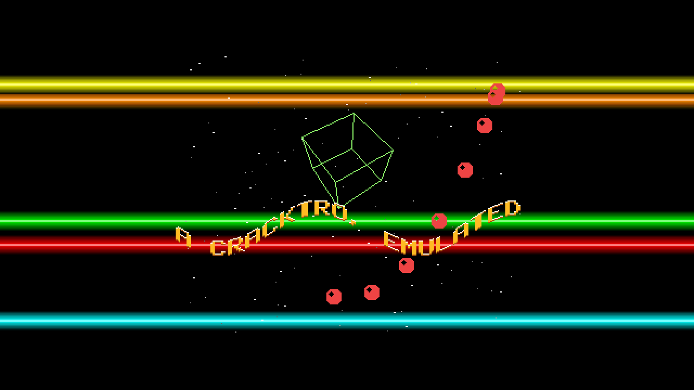

# Copperlist

> **AI-assisted project.** This codebase was created with [Claude](https://claude.com/claude-code)
> (Anthropic), directed and reviewed by a human author. The chipset is not
> asserted but measured: an offline harness drives the real plugin class and
> reads the emulated chip's own memory and picture, then the rendered output in
> a headless GL context at two rasters — every copper colour change on the
> manual's **four-pixel grid** and never closer than **one MOVE (8 px)**, two
> bars that cross resolving to the **later write, never a blend**, **576**
> blitter lines equal **pixel for pixel** to an independent Bresenham, the field
> number **exactly** `floor(t × 50)` from Resolume's ~499 million ms clock,
> every output channel a **multiple of 17**, and a field reached by running
> **byte-identical** to the same field reached by a jump (see [Status](#status)).
> Copperlist itself has **never been loaded into Resolume**, on any platform —
> not once. Check it in your own rig before trusting it in a show.

An Amiga cracktro as an FFGL **source** for [Resolume](https://resolume.com)
Arena and Avenue — not drawn to look like one, but written against an emulation
of the chips that made them look that way.

The defaults, 212 host frames in, at 1280×720 with Integer scaling (×2,
letterboxed — the copper bars run on into the border, as they did on a
monitor). Rendered by `cptest`, the offline harness, not captured from
Resolume.

**[Try it in your browser](https://copperlist-demo.stoatworks-labs.com)** — a
JavaScript port of the chip emulation and the cracktro, put on screen by the
plugin's own shader in WebGL2, with every control and a working Text field. The
port is compared byte for byte with the plugin on 500 fixed frames by
`tools/verify.sh`; it is still a port and not the plugin: read what
[the page itself says it does not reproduce](https://copperlist-demo.stoatworks-labs.com).

## Copper bars are register writes

A cracktro looks the way it does because of the chip that drew it. The Amiga's
**copper** is a tiny co-processor that waits for the video beam to reach a
screen position and then writes a value into a hardware register — usually a
colour register. **A copper bar is nothing but colour-register writes at the
start of scanlines.** So:

- **A bar is always horizontal, one line tall per colour step**, because a
  write lasts until the next one, and the next one is on the next line.
- **Two bars that cross cannot blend.** A register holds one value; the later
  write in the copper list is what is on screen.
- **A colour change in the middle of a line lands on the copper's own grid**:
  a WAIT resolves four low-resolution pixels, and each MOVE costs eight.

So Copperlist does not draw a cracktro. It **emulates the part of the chipset
that makes one** — chip RAM, the copper reading real instruction words out of
it, 32 twelve-bit colour registers, five bitplanes, eight 16-pixel sprites and
the blitter — and the demo is C++ that builds a copper list and issues blits
every field, as the original coders' code did. Every constraint lives in the
emulated machine, so the look cannot cheat.

**What falls out of it**, rather than being added on:

- **4,096 colours**, and not one more: every channel on screen is a multiple
  of 17, because a gun has four bits.
- **The starfield is three sprites**, one per layer, re-positioned by the copper
  on every line that has a star — sprite multiplexing — and moving whole pixels
  per field.
- **The scroller moves by whole pixels**, because it is blitted into a bitplane
  at an integer offset, and its wave is whole lines, because each column is a
  separate blit.
- **The cube is the blitter's line mode**, Bresenham with the manual's octant
  table; filled, it is one dot a row, exclusive-or, and an area fill.
- **Fewer bitplanes means fewer colours and fewer scenes**: at three planes the
  cube's plane is simply not fetched.
- **Colour cycling is three registers rotated.** The cheapest effect of all.
- **Fields, not frames.** The emulation runs at 50 Hz (PAL) or 60 Hz (NTSC)
  from the host clock; a 60 fps composition repeats fields and never
  interpolates one.

## The controls

**Text** — Text (the scroller's message; empty turns it off), Scroll Speed
(0–8 pixels a field), Wave Height (0–48 lines), Wave Length (40–640 columns a
cycle), Colour Cycle (off to a step every other field).

**Bars** — Bar Count (0–8), Bar Height (4–48 lines), Bar Speed, Bar Wave (0 puts
every write in horizontal blank so bars run the full width; above 0 each bar
starts at a WAIT that swings on the copper's grid), Bar Palette (Rainbow,
Fire, Ice, Mono).

**Stars** — Star Count (0–64 a layer), Star Speed (1–4 pixels a field for the
slowest layer), Layers (1–3).

**Cube** — Cube On, Cube Size, Spin X, Spin Y (0.5 is still), Filled.

**Bobs** — Bob Count (0–16), Bob Path (Lissajous, Circle, Wave, Figure Eight).

**Machine** — Standard (PAL 320×256 at 50 Hz, NTSC 320×200 at 60 Hz),
Bitplanes (1–5), Scaling (Integer — whole multiples, letterboxed; Fit — the
largest scale, nearest; Fit Smooth — bilinear), Pixel Aspect (Non-square —
**1.0397** for PAL, **0.8571** for NTSC, derived from the colour clock — or
Square; Integer ignores it), Background (Border — the colour the beam left, as
a monitor shows it; Black; Transparent).

**About** — the project's links.

Every scene is switchable by the control that already says how many: an empty
Text, Bar Count 0, Star Count 0, Bob Count 0, Colour Cycle 0, Cube On off.

## Build

    git submodule update --init --recursive
    cmake -B build -DCMAKE_BUILD_TYPE=Release
    cmake --build build

The macOS build is universal (arm64 + x86_64) by default; add
`-DCMAKE_OSX_ARCHITECTURES=arm64` for a faster dev build. Windows needs GLEW
from vcpkg (`vcpkg.json`). The bundle goes in Resolume's **Extra Effects**
folder; `cmake --install build` puts it in `~/Documents/Resolume Arena/Extra
Effects` — untested, since nothing here has been in front of Resolume.

## Building and testing

The harness renders the real plugin class headlessly and reads the emulated
chip's memory and picture directly.

    ./build/cptest --out /tmp/frame.png     a frame, through the plugin
    ./build/cptest --list                   every parameter, kind and default
    ./build/cptest --copper                 the grid, the MOVE cost, the later write wins
    ./build/cptest --line                   the blitter's lines against Bresenham
    ./build/cptest --bitplanes              n planes, never an index at or above 2^n
    ./build/cptest --fields                 floor(t x 50), from Resolume's clock
    ./build/cptest --replay                 run vs jump, byte for byte
    ./build/cptest --palette                every channel a multiple of 17
    ./build/cptest --scroll                 whole-pixel scrolling, by exact match
    ./build/cptest --scaling                the output IS the chip's picture
    ./build/cptest --bench                  ms per field, and per frame at 720p-4K
    ./build/cptest --pipe --script cues.txt raw RGBA frames out (filming, not a check)
    python3 tools/sweep.py                  no control is silently dead
    tools/verify.sh                         all of it, on a fresh universal build

The chip's claims are measured in chip RAM and in the chip's own picture, with
no rasteriser involved; the output checks run at **1280×720 and 320×180**, and
every assertion is exact — a texel for a pixel, a whole-pixel shift, a byte
comparison — with each tolerance that is not zero derived and written down.
Every check carries a **negative control**: the model perturbed one way, and
the check asserted to fail. [AGENTS.md](AGENTS.md) lists every number and
where it comes from.

## Status

**v0.1.0, unreleased, and honestly early.** Verified by measurement on an Apple
M4 Max, macOS 26.4.1, 2026-09-23:

| Check | Result |
| --- | --- |
| Copper grid and cost | 8,544 bar lines over three set-ups (PAL full width, PAL and NTSC with Bar Wave): **every colour change at x + $81 ≡ 0 (mod 4)**, **none closer than 8 px**, and **1,177 pairs exactly 8 px apart**, so the bound is reached and held |
| Later write wins | **5,982 crossing lines**: each ends on the last COLOR00 its list wrote, colours appear in list order, and **no pixel is a colour no MOVE wrote** — never a blend |
| Blitter lines | **576 lines** (96 through every octant including the ties, 480 cube edges over 40 fields): **0 pixels differ** from the closed-form Bresenham, 21,084 lit |
| Bitplanes | 1–5 planes: the highest index is always below 2ⁿ, and plane n is always in use |
| Fields | `floor(t × 50)` (60 NTSC) in exact integers for **18 × 600 frames** — 60, 30 and 24 fps, from frame 0, from Resolume's measured ~499 million ms and from 10¹⁰ ms — every frame running exactly the fields that elapsed |
| Frames share fields | at both rasters, frames on the same field are **byte-identical** and frames on different fields are not |
| Replay | 400 frames run vs a jump, and 240 frames at Resolume's epoch vs a jump: output and chip picture **byte-identical** at both rasters; a resize mid-run lands on a fresh render |
| Palette | every channel of **17.6 million output pixels** a multiple of 17, Integer and Fit, both rasters, 55 colours in use |
| Scroll | between consecutive fields **exactly one** whole-pixel shift reproduces the picture (−3 at Scroll Speed 3; −6 at ×2); with the wave on, **222 of 222** columns are the flat column moved by whole lines |
| Scaling | Integer output is the chip's picture **bit for bit** under all three Backgrounds at both rasters; Fit is **texel for texel**; the PAL rectangle measures **936 × 720** against 935.68 × 720 |
| Negative controls | a one-clock MOVE, an odd copper wake-up, a line decision term off by 2, a display ignoring BPLCON0, a float clock, a bare floor, a scroller that keeps its own position, 8-bit gradients and Fit Smooth are **each rejected** |
| Mutation test | one character of the shipped GLSL (`+ 1` → `+ 0` in the texel fetch) fails **`--scaling` (8 assertions) and `--scroll` (2)** |
| No dead controls | all **24** sweepable parameters change the picture, at 480×270 and at 320×180 |
| macOS binary | universal (`x86_64 arm64`), exports `plugMain`, ad-hoc signs |
| Host metadata | `oxbow selftest` instantiates it and sees pixels; `oxbow probe` reads **SW Copperlist / CP01 / source / inputs 0..0** |
| Render cost | about **0.86 ms a field** on the CPU for the emulation, whatever the output size, plus about 0.03–0.13 ms to upload and draw: **0.89 ms/frame at 720p, 0.89 at 1080p, 0.99 at 4K** when every frame is a new field (5.3–5.9% of a 60 fps frame; fastest of five passes, with other builds loading this machine) |

Run `tools/verify.sh` before believing any of it.

**Not done.** Copperlist has **never been loaded into Resolume** — not on
macOS, not on Windows, not once — so the host clock's unit, the text
parameter's editing and the look at a real composition size are all inherited
assumptions. The **Windows build has never been compiled**; CI exists and has
never run, because there is no remote. Nothing has run on a **rasteriser other
than this Mac's**. The emulation leaves out what does not show: the 68000,
audio, interrupts, and **DMA slot contention** — with five bitplanes the
manual's bitplane fetches take odd memory slots during the display, which on a
real machine would delay copper instructions executing inside the window; here
they are never delayed. There is **no OpenFX port**, which is not needed for
0.1.0. The browser demo is linked at the top.

The [user guide](docs/USER-GUIDE.md) covers every control, what it does and why.

[AGENTS.md](AGENTS.md) has the manual's facts with their sections, where the
manual is ambiguous, the traps, and what is assumed rather than measured.

<!-- attributions:start -->
This project is built on other people's work — see [ATTRIBUTIONS.md](ATTRIBUTIONS.md).
<!-- attributions:end -->

## Licence

MIT — see [LICENSE](LICENSE).
